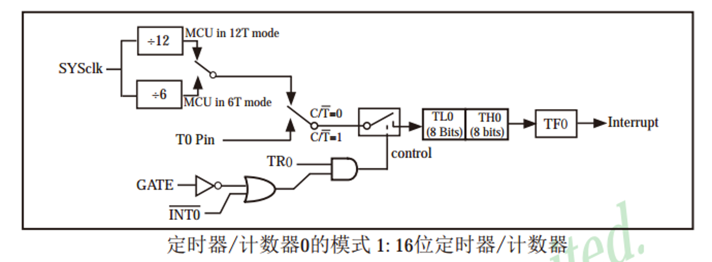
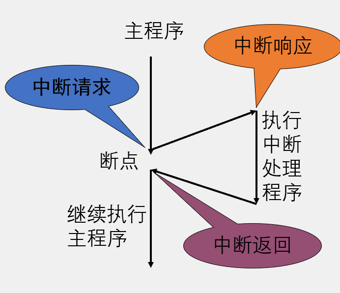

## 定时器介绍

51 单片机的定时器属于单片机的内部资源，其电路的连接和运转均在单片机内部完成

### 定时器作用

(1) 用于计时系统，可实现软件计时，或者使程序每隔一固定时间完成一项操作

(2) 替代长时间的 Delay，提高 CPU 的运行效率和处理速度

定时器个数：3 个（T0、T1、T2），T0 和 T1 与传统的 51 单片机兼容，T2 是此型号单片机增加的资源

注意：定时器的资源和单片机的型号是关联在一起的，不同的型号可能会有不同的定时器个数和操作方式，但一般来说，T0 和 T1 的操作方式是所有 51 单片机所共有的。

## 定时器框图

定时器在单片机内部就像一个小闹钟一样，根据时钟的输出信号每隔「一秒」，计数单元的数值就增加一，当计数单元数值增加到「设定的闹钟提醒时间」时，计数单元就会向中断系统发出中断申请，产生「响铃提醒」，使程序跳转到中断服务函数中执行

三部分：<u>时钟、计数单元、中断系统</u>

4 种工作模式

### 工作模式1框图



C/T = 1 为计数器，C/T = 0 为定时器

SYSclk 是时钟：系统时钟，即晶振周期，本开发板上的晶振为 12MHz（也可以由外部引脚提供）

TL0/TH0 是计数系统

## 中断系统

### 中断定义

遇到紧急情况时要求 CPU 暂时停止原工作转向其他工作，完成后能再继续原来的工作，这样的过程称为中断。

### 优先级

多个中断源同时存在，根据优先级排序

### 中断嵌套

在中断处理中又发生一个中断。

### 中断流程



<span style="border:1px solid #330000;">***<span style="color:#CC0000;">单片机通过配置不同的寄存器来控制内部线路的连接</span>***</span>

- 寄存器是连接软硬件的媒介
- 在单片机中寄存器就是一段特殊的 RAM 存储器，一方面，寄存器可以存储和读取数据，另一方面，每一个寄存器背后都连接了一根导线，控制着电路的连接方式
- 寄存器相当于一个复杂机器的「操作按钮」

TCON = Time Control 定时器/计数器控制寄存器

TF = Time Flag

TR = Time Reset（应该是吧）

TMOD = Time Mode 定时器/计数器工作模式寄存器（不可位寻址——只能整体赋值）

### 中断程序不容易模块化

### 定时器模块化

（中断程序放在下边，根据需要进一步修改）

```c
#include <STC89C5xRC.H>

/**
  * @brief  定时器0初始化，1毫秒@11.0592MHz
  * @param  无
  * @retval 无
  */

void Timer0Init(void)		//1毫秒@11.0592MHz
{ 
	TMOD &= 0xF0;		//设置定时器模式
	TMOD |= 0x01;		//设置定时器模式
	TL0 = 0x66;		//设置定时初值
	TH0 = 0xFC;		//设置定时初值
	TF0 = 0;		//清除TF0标志
	TR0 = 1;		//定时器0开始计时
	
	ET0 = 1;	//中断允许
	EA = 1;		//提供使能
	PT0 = 0;	//确定优先级最低
}

/*定时器中断函数模板
void Timer0_Routine() interrupt 1	//中断函数
{	
	static unsigned int T0Count;	//static表静态不像全局变量，static只能由本函数引用
	TL0 = 0x66;		//设置定时初值
	TH0 = 0xFC;		//设置定时初值 
	T0Count++;
	if(T0Count >= 1000)
	{
			T0Count = 0;

	}

}
*/
```

## 流水灯

### 模式切换变量与按键键码变量

不同于之前的按位左移或右移，采用头文件 `<INTRINS.H>`

```c
#include <INTRINS.H>
void main()
{
    _crol_(a,x);	//循环左移函数，a为变量，x为移动的位数
    _cror_(a,x);	//循环右移函数
}
//这种方式移位到底会循环，相比按位移动不用担心数据溢出为零。
```

坑：

### 按键消抖

```c
//以P31为例，if与while的判断都是0，若while的为1灯就会乱闪
if(P31 == 0){Delay(20);while(P31 == 0);Delay(20);KeyNumber = 1;}
```

## 定时器闹钟

注意：

LCD1602 亮灯如果是不同区块之间是互不影响的

即 `XX:XX:XX` 形式时钟的表现可以分为两部分：

1. 数字（时、分、秒需要各自的数字表示函数）
2. 冒号（其中可以用字符串表示，在有数字的地方留空格比如 `__:__:`）
