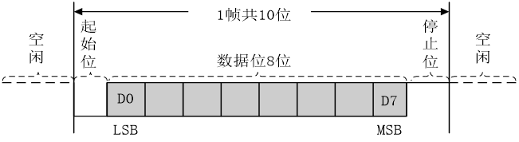
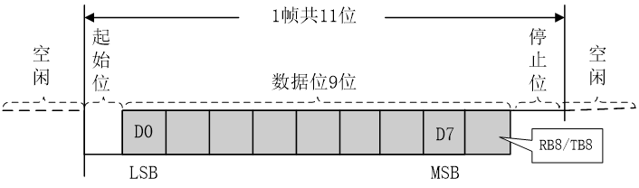

## 串口介绍

- 串口是一种应用十分广泛的通讯接口，串口成本低、容易使用、通信线路简单，可实现两个设备的互相通信。
- 单片机的串口可以使单片机与单片机、单片机与电脑、单片机与各式各样的模块互相通信，极大的扩展了单片机的应用范围，增强了单片机系统的硬件实力（**单片机内部芯片储存有限，通过串口一定程度上扩展了空间**）。
- 51 单片机内部自带 UART（Universal Asynchronous Receiver Transmitter，通用异步收发器）可实现单片机的串口通信。

### 硬件电路

- 简单双向串口通信有两个通信线（发送端 TXD - transmit exchange data 和接收端 RXD - receive exchange data）
- TXD 和 RXD 要交叉连接
- 当只需单向的数据传输时，可以直接一根通信线
- 当电平标准不一致时，需要加电平转换芯片

### 电平标准

- 电平标准是数据 1 和数据 0 的表达方式，是传输线缆中人为规定的电压与数据的对应关系，串口常用的电平标准有如下三种：
- TTL 电平：+5V 表示 1，0V 表示 0
- RS232 电平：-3 ~ -15V 表示 1，+3 ~ +15V 表示 0
- RS485 电平：两线压差 +2 ~ +6V 表示 1，-2 ~ -6V 表示 0（差分信号）

## 接口及引脚定义

## 常见通信接口比较

| 名称                                           |                      | 通信方式     | 特点           |
| ---------------------------------------------- | -------------------- | ------------ | -------------- |
| UART                                           | TXD、RXD             | 全双工、异步 | 点对点通信     |
| I2C | SCL(时钟线)、SDA     | 半双工、同步 | 可挂载多个设备 |
| SPI                                            | SCLK、MOSI、MISO、CS | 全双工、同步 | 可挂载多个设备 |
| 1-Wire                                         | DQ                   | 半双工、异步 | 可挂载多个设备 |

此外还有 CAN、USB

### 相关术语概念常识

- 全双工：通信双方可以在同一时刻互相传输数据
- 半双工：通信双方可以互相传输数据，但必须分时复用一根数据线
- 单工：通信只能有一方发送到另一方，不能反向传输，单向传输

- 异步：通信双方各自约定通信速率

- 同步：通信双方靠一根时钟线来约定通信速率

- 总线：连接各个设备的数据传输线路（类似于一条马路，把路边各住户连接起来，使住户可以相互交流）

## 51单片机的UART（通用异步收发器）

- STC89C52 有 1 个 UART
- STC89C52 的 UART 有四种工作模式：

        模式0：同步移位寄存器 
        
        模式1 ：8位UART，波特率可变（常用） 
        
        模式2 ：9位UART，波特率固定 
        
        模式3 ：9位UART，波特率可变

## 串口参数及时序图

- 波特率：串口通信的速率（发送和接受各数据位的间隔时间）

- 检验位：用于数据认证

- 停止位：用于数据帧间隔

  8 位数据格式

  9 位数据格式

串口中定时器用双 8 位自动重装模式

> 波特率的具体计算（定时器初值怎么算、常用波特率速查表）见[单片机波特率计算公式](/posts/embedded/51-uart-baudrate/)。

## 数据显示模式

**数据显示模式**

- HEX 模式/十六进制模式/二进制模式：以原始数据的形式显示
- 文本模式/字符模式：以原始数据编码后的形式显示

**坑：**<u>一个相同函数不能同时存在于主函数与子函数内</u>
